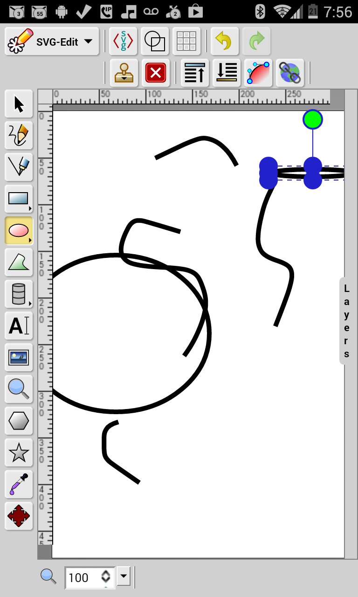

# Svg-Edit-Ubiq

An app which starts svg-edit inside it just like the web demos. 
It is made in a container framework of Apache Cordova and so it should run on many types of devices 

* Android https://github.com/hgkamath/Svg-Edit-Ubiq/raw/master/platforms/android/ant-build/SVGEditUbiq-debug.apk
* Firefox OS https://github.com/hgkamath/Svg-Edit-Ubiq/blob/master/platforms/firefoxos/www/manifest.webapp

It is also possible to build on blackberry10, ubuntu if you have the system/dev-tool-chain.

### comments:
* 20140806: svg-edit-2.7: UI not touch optimized.

### License
same license as SVG-edit
MIT License

</img>
